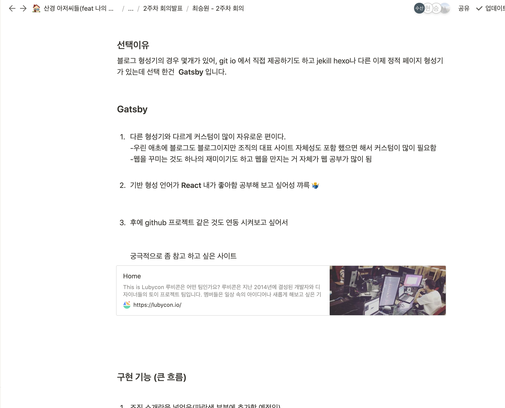
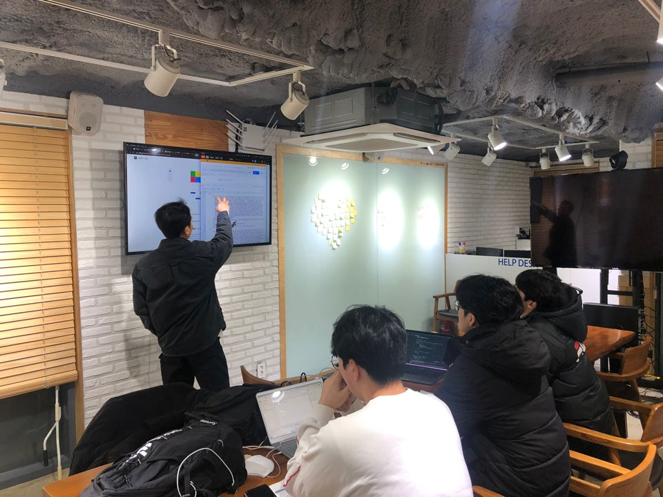

## 들어가며

2주차 회의인데 생각 보다 힘들면서 생각 보다 재미있는 일이 많은 것 같다. 
무엇보다 혼자 하는 일이 아니라는 것을 다시 한 번 느겻 던 것 같다. 생각 보다다도 애들한테 배우는 것 도 많았고 열심히 하는 모습에 자극 받기도 했던 것 같다. 

회의에서도 주로 나눴던 고민과 결정 사항이 사실 이 조직아닌 모임의 목정성이다. 
내린 결정은 어떤 분야, 웹, 앱, 알고리즘, 인공지능이 되았든 생각을 구현하는 데에 있다고 생각 했다. 생각이 생각에, 공부 내용이 노트에 머무르지 말고, 존재하는 것으로 남았으면 했다. 

그러기 위한 첫 과정이 사실 앱이던, 웹이던 올릴 수 있는 능력이라고 생각 한다. 템플릿이 너무 잘되어있어 그저 많은 곳에서 손을 빌리 수도 있지만 학생인 우리가 굳이 배울 것을 피해 가는 것도 웃겨 보였다.  

교수님이 말씀하셨던 것 처럼 사실  앱을 만드는 기술을 익히고자 하는 것은 아닌것 같다.하지만, 구현하고자 하는 것을 존재하게 하기 위한 첫 걸음 이라는 생각도 들었다. 좀더 깊은 기술적 내용과 아이디어를 올릴 곳이 필요하고, 필요한 과정이라는 생각이 든다.

## 발표

### notion

노션을 이용하여 각자의 발표 자료를 준비하는 식으로 회의를 진행하기로 했다. 해 온 것 만큼 표현하는 것도 일이라고 생각하고, 없어도 있는 척 표햔 할 줄 아는 것 도 중요하다고 생각했다.

가지고 있는 생각이나, 흐름의 정리를 그대로 표현 하는 것 조차 버겁다. 대학 생활을 해봐야 공대에서 워드로 페이지 늘리기 급급했던 날들 밖에 없으니 당연한 결과인가 싶었다. 없는 걸 있다고 하는 것도 아니며, 있는 것을 온전히 표현하기 위해서도 문서의 작성과 적당한 이미지, **굵기 차이**, *이태리체*, 등을 사용하기 위해서 notion에서 제공하는 효과도 좋지만 Markdown 문법을 주로 이용하기로 했다.

### 발표 태도..?

웃긴게 서로 아는 6명의 발표를 보니 아는 것 보다 유연하게 벌표를 하는 사람과 아는게 분명히 많은 데 표현력이 부족해서 그만큼 못 와닿게 발표를 한 인원들이 보이는 것이  웃겼던 것 같다.

그런 과정을 보니 매주 하나의 발표를 모두 할 수 있게 된 시스템 자체는 필요할까 했지만 지나고 보니 너무나 필요한 과정 같았다. !

## 회의 결과

 ### 지금까지

지금까지의 구현 내용은 사실 이러한 회의 흐름을 구축하고 github파고 분명한 역할나눔과 서로에 관한 언제 까지 무엇을 요구하면 무엇이 올꺼라는 신뢰 구축 정도 인데 써놓고 보니 대단한 일을 한거 같네ㅋㅋㅋㅋ.

### 다음 회의의 구축

* 앞단의 구축

  1. 홈 화면 디자인의 흐름도

  2. 디자인 쪽에서의 공지란의 캘린더에서의 필요 기능 요구

  3. request 발생 로직 구현

  4. 요구된 기능의 구현

     

* 뒷단의 구축

  1. HTTP 통신의 이해

  2. route의 구축

  3. DB 의 설계

     

* 조직화 홈페이지 구축, **이름** 

 

## 마무리하며

사실 구현 하면서 조금씩 드는 생각이 힘들다..ㅋㅋㅋㅋㅋㅋㅋㅋㅋㅋㅋ 그래서인지 교수님이 하셨던 필요해 의한 공부와 구현을 했으면 한다. 너무나 방대한 필요 지식과, 제공되는 지식들에서 휩쓸려 가고 있는 듯한 내가 안쓰러워서라도 그렇게 할 예정이다. 

그렇게 필요할 때 적어내려간 지식이 뭐 언젠가의 내를 조금은 땡겨주지 않을까 싶다. 이상

